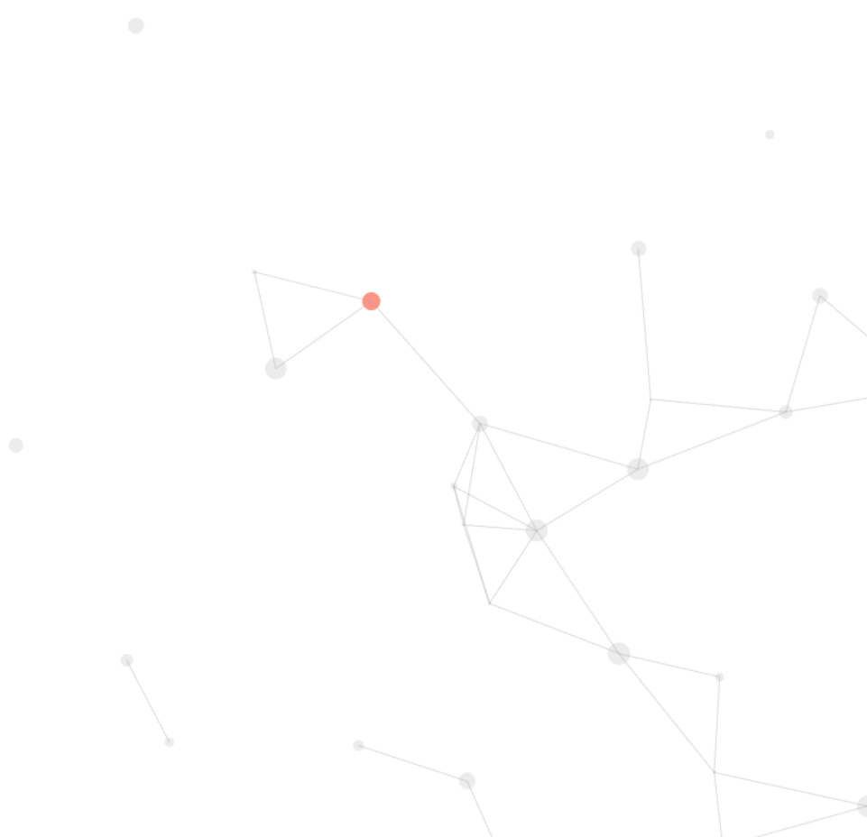

# canvas-nest.js

[](../../graphs/commit-activity)


[](https://github.com/HollowMan6?tab=followers)
[](../../watchers)
[](../../stargazers)
[](../../network/members)

[](https://hollowman6.github.io/fund.html)
[](https://opensource.org/licenses/GPL-3.0/)
[](../../archive/master.zip)

[](https://lgtm.com/projects/g/HollowMan6/canvas-nest.js/alerts/)
[](https://lgtm.com/projects/g/HollowMan6/canvas-nest.js/context:javascript)

(English version is down below.)



**新**: *V1.1.0*: 增加对`IE 11`的支持。

**新**: *V1.0.6*: 修复了小球初始移动方向只为右下角，导致短时间内左上角出现空白，右下角过密的情况。

粒子运动背景插件，仿老版知乎登录页面。

此项目在 https://github.com/sunshine940326/🕸️%20canvas-nest/blob/master/src/index.js 基础上进行了许多改进，使得使用更加方便，且适用于更多场景。

[示例网页](sample.html) 预览效果：http://practice.hollowman.ml/canvas-nest.js/sample.html

## 使用

将下面的代码插入到 `<body> 和 </body> 之间`.

```html
<script type="text/javascript" src="canvas-nest.js"></script>
```

强烈建议在 `</body>`标签上方. 例如下面的代码结构:

```html
<html>
<head>
	...
</head>
<body>
	...
	...
	<script type="text/javascript" src="canvas-nest.js"></script>
</body>
</html>
```

然后就完成了，打开网页即可看到效果!`请注意不要将代码置于 <head> </head>里面`.

# canvas-nest.js

**NEW**: *V1.1.0*: Add support for `IE 11`.

**NEW**: *V1.0.6*: Fix the BUG relating to balls' initial moving direction only to down-right, leading to temporarily blank in top-left corner and too dense in down-right corner.

A nest background drawn on canvas.

This project is derived from https://github.com/sunshine940326/canvas-nest/blob/master/src/index.js . Many improvements have been made to make it more convenient to use and suitable for more scenes.

[Sample Page](sample.html) real-time watching: http://practice.hollowman.ml/🕸️%20canvas-nest.js/sample.html

## Usage

Insert the code below `between <body> and </body>`.

```html
<script src="canvas-nest.js"></script>
```

Strongly suggest to insert before the tag `</body>`, as the following:

```html
<html>
<head>
	...
</head>
<body>
	...
	...
	<script src="canvas-nest.js"></script>
</body>
</html>
```

Then ok! `Please do not add the code in the <head> </head>`.
